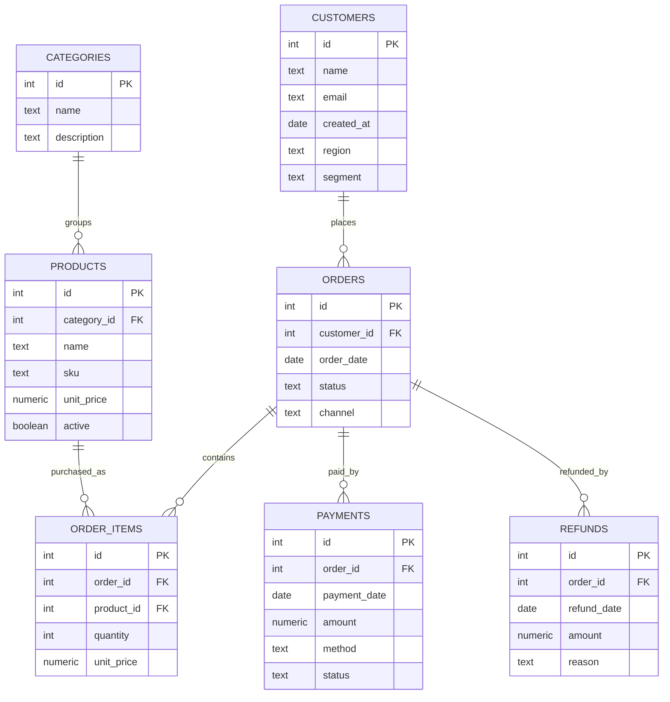
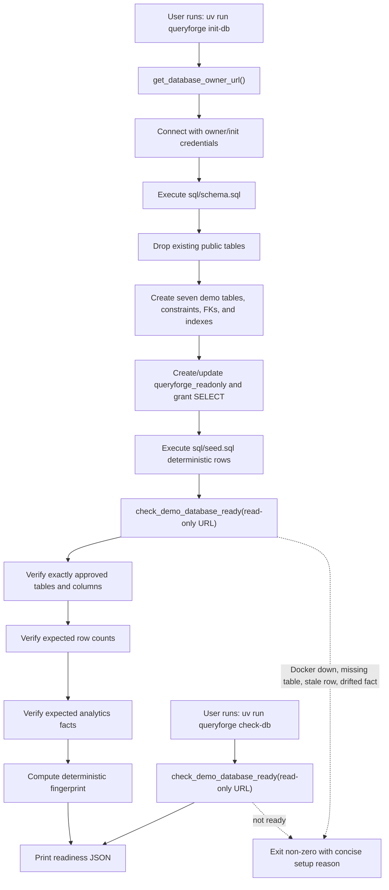
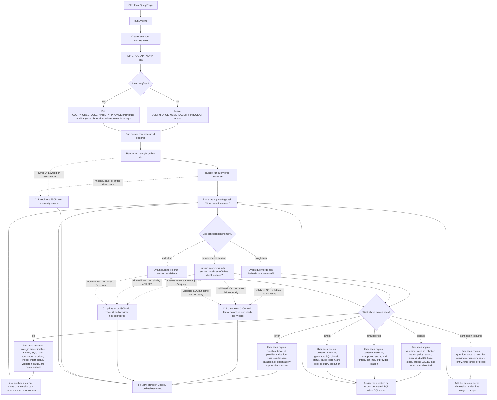
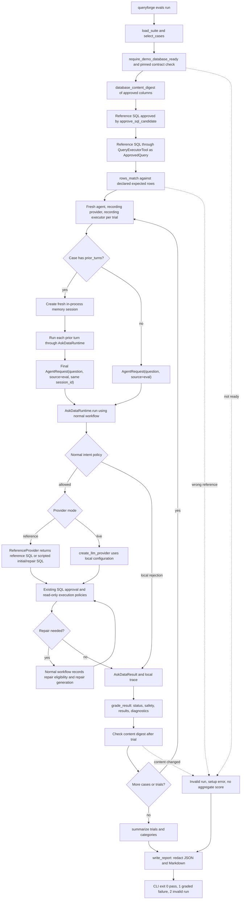
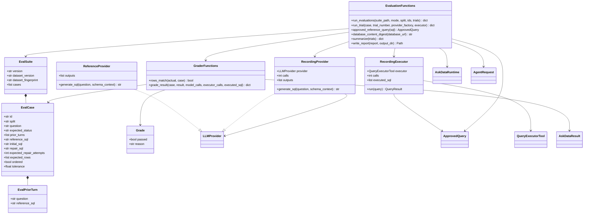
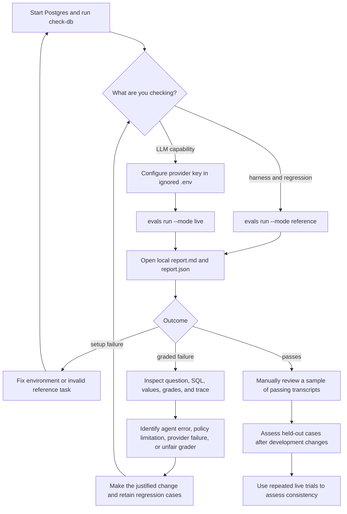

# QueryForge Architecture Diagrams

This is the living diagram page for QueryForge. Update it whenever an OpenSpec change alters the user flow, module boundaries, core classes, result models, statuses, setup steps, or execution path.

Current scope: local CLI Ask Data flow for a stabilized seven-table Postgres
demo database with required memory read/write workflow boundaries, process-local
session memory, LangGraph orchestration, one bounded SQL repair attempt, bounded
local traces, optional Langfuse export, execution-time demo database readiness
checks, and reference/live evaluation commands.

## Demo Schema

## Database Setup Flow

## Code Flow

```mermaid
flowchart TD
    user["User runs: queryforge ask [--session id] <question> or queryforge chat --session id"] --> cli_main["cli.main()"]
    cli_main --> cli_ask["cli.ask(question, session_id) or cli.chat(session_id)"]

    cli_ask --> obs_config["load_observability_config()"]
    obs_config --> obs_exporter["create_trace_exporter(config)"]
    obs_exporter --> noop_exporter["NoOpTraceExporter when Langfuse is disabled"]
    obs_exporter --> langfuse_exporter["LangfuseTraceExporter when Langfuse is configured"]

    cli_ask --> query_tool["QueryExecutorTool()"]
    query_tool --> query_url["get_database_url() read-only execution URL"]
    cli_ask --> memory_store["CLI process InMemorySessionStore"]
    cli_ask --> runtime["AskDataRuntime(create_llm_provider, query_tool, memory_store, trace_exporter, trace_preview_rows)"]

    runtime --> request["AgentRequest(question, source=cli, session_id?)"]
    request --> ask_graph["AskDataGraph.run(request)"]
    ask_graph --> trace_id["generate_trace_id()"]
    ask_graph --> recorder["LocalTraceRecorder(question, trace_id)"]

    recorder --> memory_read["memory_read node"]
    memory_read --> memory_choice{"session_id present?"}
    memory_choice -- no --> memory_skip["Record no-session memory skip"]
    memory_choice -- yes --> load_memory["Load bounded same-session MemoryContext"]
    load_memory --> intent_node["intent_policy node"]
    memory_skip --> intent_node
    intent_node --> intent["evaluate_intent_policy(question)"]
    intent --> intent_decision{"IntentPolicyDecision.status"}

    intent_decision -- blocked --> skip_intent["Record skipped context, provider, LLM, SQL validation, approval, query execution, and answer rendering"]
    intent_decision -- unsupported --> skip_intent
    intent_decision -- clarification_required --> skip_intent

    intent_decision -- allowed --> context_node["context_build node"]
    context_node --> context_builder["build_query_context(request, memory_context)"]
    context_builder --> query_context["QueryContext(schema_text plus bounded memory context, examples)"]

    query_context --> provider_node["provider_resolution node"]
    provider_node --> provider_factory["create_llm_provider()"]
    provider_factory --> dotenv["load_dotenv()"]
    dotenv --> provider_config["Read provider, model, and GROQ_API_KEY"]
    provider_config --> llm["LLMProvider implementation"]
    provider_factory -. missing provider config .-> skip_provider["Record provider error and skipped generation, validation, approval, and DB work"]

    llm --> generation_node["llm_sql_generation node"]
    generation_node --> generator["generate_sql_candidate(llm, request, context)"]
    generator --> llm_call["llm.generate_sql(question, context.schema_text)"]
    llm_call --> candidate["SQLCandidate(sql, provider, model, attempt)"]
    llm_call -. provider unsupported or error .-> skip_generation["Record generation failure and skipped validation, approval, and DB work"]

    candidate --> validation_node["sql_validation node"]
    validation_node --> approver["approve_sql_candidate(candidate)"]
    approver --> policy["evaluate_sql_policy(candidate.sql)"]
    policy --> cast_policy["AST safety: approved cast targets and bounded modifiers; nested operands still checked"]
    cast_policy --> sql_decision{"SQLPolicyDecision.status"}

    sql_decision -- blocked --> repair_check["Record sql_repair_eligibility"]
    sql_decision -- unsupported --> repair_check
    sql_decision -- invalid --> repair_check
    repair_check -- non-repairable or repair used --> skip_sql["Record SQL policy failure and skipped approval/query execution"]
    repair_check -- repairable and unused --> repair_generation["sql_repair_generation node"]
    repair_generation --> repair_generator["generate_repaired_sql_candidate(llm, request, context, failed SQL, failure source, failure reason)"]
    repair_generator --> repair_call["llm.generate_sql(repair prompt, context.schema_text)"]
    repair_call --> repair_candidate["SQLCandidate(sql, provider, model, attempt=2)"]
    repair_candidate --> validation_node
    repair_call -. provider unsupported or error .-> skip_sql
    sql_decision -- allowed --> approval_step["Record query_approval and create ApprovedQuery"]
    approval_step --> approved_query["ApprovedQuery(normalized_sql, policy decision)"]
    approved_query --> execution_node["query_execution node"]

    execution_node --> execute["query_tool.run(ApprovedQuery)"]
    execute --> revalidate["evaluate_sql_policy(approved_query.sql) again, including casts"]
    revalidate --> readiness_check["require_demo_database_ready(read-only URL)"]
    readiness_check --> readiness_payload["Verify version, table shape, row counts, facts, and fingerprint"]
    readiness_payload --> readonly_pg["Postgres read-only role via psycopg"]
    readonly_pg --> timeout["SET statement_timeout = '5s'"]
    timeout --> sql_execute["Execute normalized SELECT"]
    sql_execute --> rows["QueryResult rows + row_count"]

    revalidate -. policy mismatch .-> skip_execution["Record execution validation error and skipped answer rendering"]
    readiness_check -. missing, stale, drifted, or unreachable DB .-> skip_execution
    sql_execute -. non-repairable timeout, readiness, or database error .-> skip_execution
    sql_execute -. repairable SQL-shape database error and repair unused .-> repair_generation

    rows --> render_node["answer_rendering node"]
    render_node --> render["render_rows_as_answer(question, rows)"]
    render --> final_node["final_result node"]

    skip_intent --> final_node
    skip_provider --> final_node
    skip_generation --> final_node
    skip_sql --> final_node
    skip_execution --> final_node

    final_node --> memory_write["memory_write: save bounded turn summary or record skip/error"]
    memory_write --> finish_trace["recorder.finish(status)"]
    finish_trace --> export_trace{"Trace exporter"}
    export_trace -- local/no-op --> result["AskDataResult with request_id, trace_id, and bounded trace"]
    export_trace -- Langfuse configured --> langfuse["Export RunTrace events to Langfuse"]
    langfuse -. export failure .-> export_error["Record export error without changing query status"]
    langfuse --> result
    export_error --> result

    result --> json["Print AskDataResult-compatible JSON"]
```

## Class Diagram

```mermaid
classDiagram
    class AskDataRuntime {
        +AskDataGraph _graph
        +run(request) AskDataResult
    }

    class AskDataGraph {
        +run(request) AskDataResult
        +load_memory(state) dict
        +evaluate_intent(state) dict
        +build_context(state) dict
        +resolve_provider(state) dict
        +generate_sql(state) dict
        +validate_sql(state) dict
        +repair_sql(state) dict
        +execute_query(state) dict
        +render_answer(state) dict
        +finalize_result(state) AskDataResult
    }

    class AskDataGraphState {
        <<TypedDict>>
        +AgentRequest request
        +str trace_id
        +TraceRecorder recorder
        +TraceExporter? trace_exporter
        +MemoryStore memory_store
        +MemoryContext? memory_context
        +ContextBuilder context_builder
        +QueryContext? context
        +LLMProvider? llm
        +SQLCandidate? candidate
        +list attempts
        +ApprovedQuery? approved_query
        +QueryResult? query_result
        +bool repair_used
        +str? repair_failure_source
        +str? repair_failure_reason
        +str? repair_failed_sql
        +IntentPolicyDecision? intent_decision
        +SQLPolicyDecision? sql_decision
        +AskDataResult? result
    }

    class AgentRequest {
        +str question
        +str request_id
        +RequestSource source
        +str? session_id
    }

    class QueryContext {
        +str schema_text
        +list examples
    }

    class ContextFunctions {
        +build_query_context(request, memory_context, schema_text) QueryContext
    }

    class MemoryStore {
        <<Protocol>>
        +str name
        +load(session_id) MemoryContext
        +append(session_id, turn) None
        +clear(session_id) None
    }

    class InMemorySessionStore {
        +str name
        +int max_turns
        +load(session_id) MemoryContext
        +append(session_id, turn) None
        +clear(session_id) None
    }

    class NoMemoryStore {
        +str name
        +load(session_id) MemoryContext
        +append(session_id, turn) None
        +clear(session_id) None
    }

    class MemoryContext {
        +str? session_id
        +list recent_turns
        +AnalysisReference? latest_analysis
        +int used_turn_count
    }

    class ConversationTurn {
        +str turn_id
        +str question
        +AgentStatus status
        +str? sql
        +list columns
        +int row_count
        +list preview_rows
        +str answer
        +str trace_id
        +str? policy_code
        +str? policy_reason
        +datetime created_at
    }

    class AnalysisReference {
        +str analysis_id
        +str question
        +str approved_sql
        +list columns
        +int row_count
        +list preview_rows
        +str answer
        +str trace_id
        +datetime created_at
    }

    class GenerationFunctions {
        +generate_sql_candidate(llm, request, context) SQLCandidate
        +generate_repaired_sql_candidate(llm, request, context, failed_sql, failure_source, failure_reason) SQLCandidate
    }

    class RepairFunctions {
        +validation_failure_is_repairable(decision) bool
        +execution_failure_is_repairable(error) bool
    }

    class SQLCandidate {
        +str sql
        +str provider
        +str model
        +int attempt
    }

    class PolicyDecision {
        +PolicyStatus status
        +str code
        +str reason
    }

    class ApprovedQuery {
        +str sql
        +PolicyDecision decision
    }

    class ApprovalFunctions {
        +approve_sql_candidate(candidate) tuple
    }

    class QueryResult {
        +str sql
        +list rows
        +int row_count
    }

    class LLMProvider {
        <<Protocol>>
        +str provider_name
        +str model_name
        +generate_sql(question, schema_context) str
    }

    class OpenAICompatibleLLMProvider {
        +str provider_name
        +str model_name
        +str api_key
        +str base_url
        +float timeout_seconds
        +generate_sql(question, schema_context) str
    }

    class GroqLLMProvider {
        +provider_name = "groq"
    }

    class QueryExecutorTool {
        +str database_url
        +bool check_readiness
        +run(query) QueryResult
    }

    class DemoDatabaseContract {
        +str DEMO_DATASET_VERSION
        +str DEMO_SCHEMA_NAME
        +tuple DEMO_TABLES
        +dict EXPECTED_ROW_COUNTS
        +dict EXPECTED_FACTS
        +str EXPECTED_DATASET_FINGERPRINT
    }

    class DemoDatabaseReadiness {
        +bool ready
        +str version
        +str? fingerprint
        +str expected_fingerprint
        +str reason
        +dict table_counts
        +dict facts
        +tuple missing_tables
        +tuple extra_tables
        +dict missing_columns
        +to_dict() dict
    }

    class DemoDatabaseNotReadyError {
        +DemoDatabaseReadiness readiness
    }

    class PostgresSupport {
        +get_database_owner_url() str
        +get_database_url() str
        +init_database() DemoDatabaseReadiness
        +check_demo_database_ready() DemoDatabaseReadiness
        +require_demo_database_ready() DemoDatabaseReadiness
    }

    class TraceRecorder {
        <<Protocol>>
        +record_step(name, status, metadata, error) TraceStep
        +record_skipped_step(name, reason, metadata) TraceStep
        +finish(status, metadata) RunTrace
        +record_export_error(provider, message) None
        +snapshot() RunTrace
    }

    class LocalTraceRecorder {
        +RunTrace trace
        +record_step(name, status, metadata, error) TraceStep
        +record_skipped_step(name, reason, metadata) TraceStep
        +finish(status, metadata) RunTrace
        +record_export_error(provider, message) None
        +snapshot() RunTrace
    }

    class TraceExporter {
        <<Protocol>>
        +str provider_name
        +export(trace) None
    }

    class NoOpTraceExporter {
        +provider_name = "local"
        +export(trace) None
    }

    class LangfuseTraceExporter {
        +provider_name = "langfuse"
        +from_config(config) LangfuseTraceExporter
        +export(trace) None
    }

    class ObservabilityConfig {
        +str provider
        +bool enabled
        +str? langfuse_public_key
        +str? langfuse_secret_key
        +str langfuse_base_url
        +int trace_preview_rows
        +list warnings
    }

    class AskDataResult {
        +str request_id
        +str question
        +AgentStatus status
        +str answer
        +str trace_id
        +RunTrace? trace
        +str? sql
        +list rows
        +int row_count
        +str provider
        +str model
        +IntentPolicyStatus? intent_status
        +SQLPolicyStatus? validation_status
        +str? policy_code
        +str? policy_reason
    }

    class RunTrace {
        +str trace_id
        +str question
        +AgentStatus? status
        +datetime started_at
        +datetime? finished_at
        +float? duration_ms
        +list TraceStep steps
        +list TraceExportError export_errors
    }

    class TraceStep {
        +str name
        +TraceStepStatus status
        +datetime started_at
        +datetime finished_at
        +float duration_ms
        +dict metadata
        +str? error
    }

    class IntentPolicy {
        +evaluate_intent_policy(question) IntentPolicyDecision
    }

    class SQLSafety {
        +evaluate_sql_policy(sql) SQLPolicyDecision
    }

    LLMProvider <|.. OpenAICompatibleLLMProvider
    OpenAICompatibleLLMProvider <|-- GroqLLMProvider
    AskDataRuntime --> AskDataGraph
    AskDataGraph --> AskDataGraphState
    AskDataGraph --> AgentRequest
    AskDataGraph --> MemoryStore
    AskDataGraph --> MemoryContext
    AskDataGraph --> ContextFunctions
    AskDataGraph --> GenerationFunctions
    GenerationFunctions --> LLMProvider
    GenerationFunctions --> SQLCandidate
    AskDataGraph --> ApprovalFunctions
    AskDataGraph --> RepairFunctions
    ApprovalFunctions --> SQLCandidate
    ApprovalFunctions --> SQLPolicyDecision
    ApprovalFunctions --> ApprovedQuery
    ApprovedQuery --> PolicyDecision
    AskDataGraph --> LLMProvider
    AskDataGraph --> QueryExecutorTool
    AskDataGraph --> TraceRecorder
    AskDataGraph --> TraceExporter
    AskDataGraph --> IntentPolicy
    AskDataGraph --> AskDataResult
    AskDataGraph --> QueryResult
    QueryExecutorTool --> SQLSafety
    QueryExecutorTool --> ApprovedQuery
    QueryExecutorTool --> PostgresSupport
    QueryExecutorTool --> QueryResult
    InMemorySessionStore ..|> MemoryStore
    NoMemoryStore ..|> MemoryStore
    InMemorySessionStore --> ConversationTurn
    InMemorySessionStore --> AnalysisReference
    MemoryContext --> ConversationTurn
    MemoryContext --> AnalysisReference
    PostgresSupport --> DemoDatabaseContract
    PostgresSupport --> DemoDatabaseReadiness
    DemoDatabaseNotReadyError --> DemoDatabaseReadiness
    LocalTraceRecorder ..|> TraceRecorder
    NoOpTraceExporter ..|> TraceExporter
    LangfuseTraceExporter ..|> TraceExporter
    LocalTraceRecorder --> RunTrace
    RunTrace --> TraceStep
    AskDataResult --> RunTrace
```

## User Action Diagram

## Evaluation Code Flow

The eval runner is an external driver of `AskDataRuntime`; it does not create a
second SQL generation or execution path. Reference and live runs both use local
traces.

## Evaluation Class Relationships

## Evaluation User Actions

## Maintenance Checklist

- Update the code-flow diagram when the execution path changes.
- Update the class diagram when core classes, protocols, result models, or policy contracts change.
- Update the user action diagram when setup commands, CLI commands, or user-visible statuses change.
- Update `docs/demo-database.md` and its docs consistency test when seed facts or the dataset fingerprint change.
- Update evaluation diagrams when trial isolation, provider mode, grading, reports, or CLI selection changes; validate Mermaid syntax and check names against code.
- Keep module boundaries SOLID-aligned: providers generate candidates, policy validates, executors run approved work, observability records diagnostics, and agents/graphs orchestrate.
- Add abstractions only when they protect a real extension point or remove meaningful coupling.
- Keep future-stage features out of the current diagram until they exist in code.
