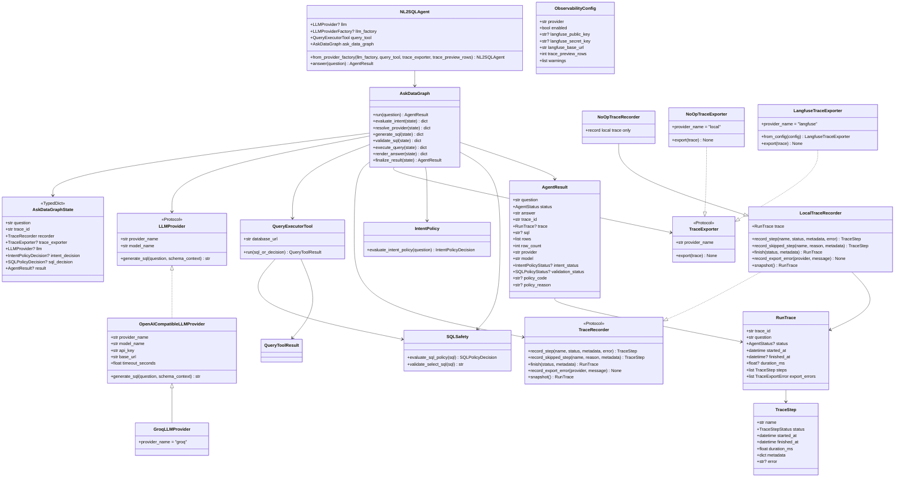
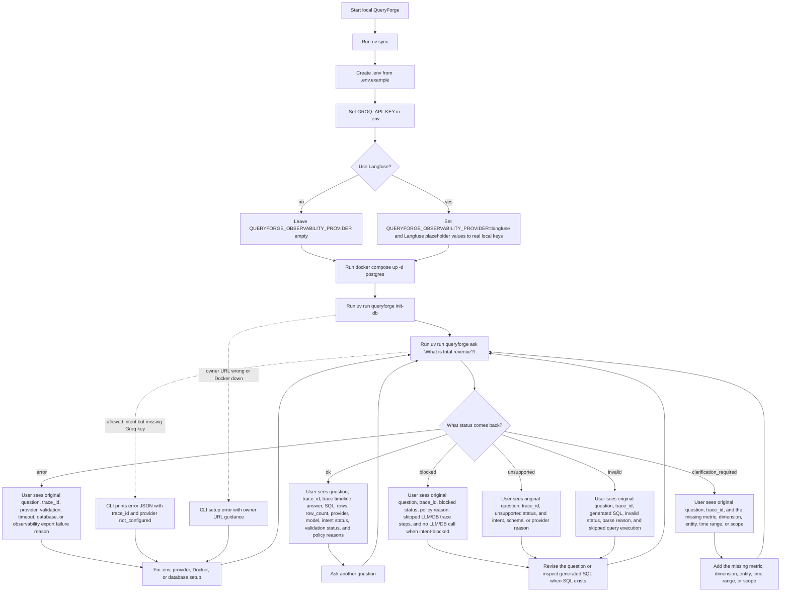

# QueryForge Architecture Diagrams

This is the living diagram page for QueryForge. Update it whenever an OpenSpec change alters the user flow, module boundaries, core classes, result models, statuses, setup steps, or execution path.

Current scope: local CLI Ask Data flow for Postgres with LangGraph orchestration, bounded local traces, and optional Langfuse export.

## Code Flow

```mermaid
flowchart TD
    user["User runs: queryforge ask <question>"] --> cli_main["cli.main()"]
    cli_main --> cli_ask["cli.ask(question)"]

    cli_ask --> obs_config["load_observability_config()"]
    obs_config --> obs_exporter["create_trace_exporter(config)"]
    obs_exporter --> noop_exporter["NoOpTraceExporter when Langfuse is disabled"]
    obs_exporter --> langfuse_exporter["LangfuseTraceExporter when Langfuse is configured"]

    cli_ask --> query_tool["QueryExecutorTool()"]
    query_tool --> query_url["get_database_url() read-only execution URL"]
    cli_ask --> agent["NL2SQLAgent.from_provider_factory(create_llm_provider, query_tool, trace_exporter, trace_preview_rows)"]

    agent --> graph["AskDataGraph.run(question)"]
    graph --> trace_id["generate_trace_id()"]
    graph --> recorder["LocalTraceRecorder(question, trace_id)"]

    recorder --> intent_node["intent_policy node"]
    intent_node --> intent["evaluate_intent_policy(question)"]
    intent --> intent_decision{"IntentPolicyDecision.status"}

    intent_decision -- blocked --> skip_intent["Record skipped provider, LLM, SQL validation, query execution, and answer rendering"]
    intent_decision -- unsupported --> skip_intent
    intent_decision -- clarification_required --> skip_intent

    intent_decision -- allowed --> provider_node["provider_resolution node"]
    provider_node --> provider_factory["create_llm_provider()"]
    provider_factory --> dotenv["load_dotenv()"]
    dotenv --> provider_config["Read provider, model, and GROQ_API_KEY"]
    provider_config --> llm["LLMProvider implementation"]
    provider_factory -. missing provider config .-> skip_provider["Record provider error and skipped LLM/DB work"]

    llm --> generation_node["llm_sql_generation node"]
    generation_node --> schema["SCHEMA_CONTEXT"]
    generation_node --> llm_call["llm.generate_sql(question, schema_context)"]
    llm_call --> candidate_sql["Candidate SQL text"]
    llm_call -. provider unsupported or error .-> skip_generation["Record generation failure and skipped validation/DB work"]

    candidate_sql --> validation_node["sql_validation node"]
    validation_node --> policy["evaluate_sql_policy(candidate_sql)"]
    policy --> sql_decision{"SQLPolicyDecision.status"}

    sql_decision -- blocked --> skip_sql["Record SQL policy failure and skipped query execution"]
    sql_decision -- unsupported --> skip_sql
    sql_decision -- invalid --> skip_sql
    sql_decision -- allowed --> execution_node["query_execution node"]

    execution_node --> execute["query_tool.run(SQLPolicyDecision)"]
    execute --> revalidate["evaluate_sql_policy(normalized_sql) again"]
    revalidate --> readonly_pg["Postgres read-only role via psycopg"]
    readonly_pg --> timeout["SET statement_timeout = '5s'"]
    timeout --> sql_execute["Execute normalized SELECT"]
    sql_execute --> rows["QueryToolResult rows + row_count"]

    revalidate -. policy mismatch .-> skip_execution["Record execution validation error and skipped answer rendering"]
    sql_execute -. timeout or database error .-> skip_execution

    rows --> render_node["answer_rendering node"]
    render_node --> render["render_rows_as_answer(question, rows)"]
    render --> final_node["final_result node"]

    skip_intent --> final_node
    skip_provider --> final_node
    skip_generation --> final_node
    skip_sql --> final_node
    skip_execution --> final_node

    final_node --> finish_trace["recorder.finish(status)"]
    finish_trace --> export_trace{"Trace exporter"}
    export_trace -- local/no-op --> result["AgentResult with trace_id + bounded trace"]
    export_trace -- Langfuse configured --> langfuse["Export RunTrace events to Langfuse"]
    langfuse -. export failure .-> export_error["Record export error without changing query status"]
    langfuse --> result
    export_error --> result

    result --> json["Print AgentResult JSON"]
```

## Class Diagram



## User Action Diagram



## Maintenance Checklist

- Update the code-flow diagram when the execution path changes.
- Update the class diagram when core classes, protocols, result models, or policy contracts change.
- Update the user action diagram when setup commands, CLI commands, or user-visible statuses change.
- Keep module boundaries SOLID-aligned: providers generate candidates, policy validates, executors run approved work, observability records diagnostics, and agents/graphs orchestrate.
- Add abstractions only when they protect a real extension point or remove meaningful coupling.
- Keep future-stage features out of the current diagram until they exist in code.
