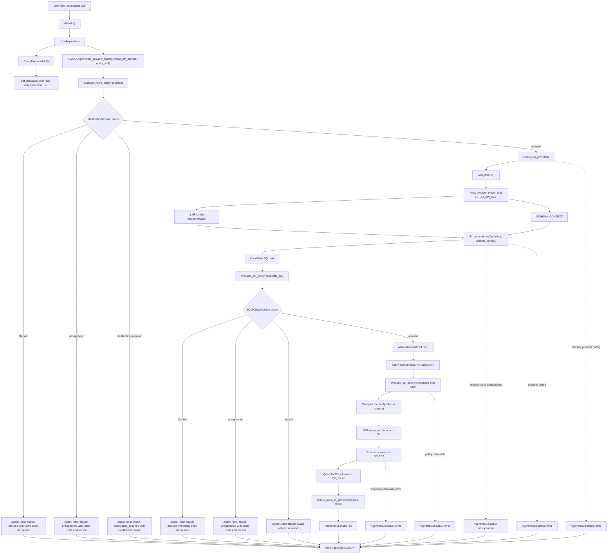
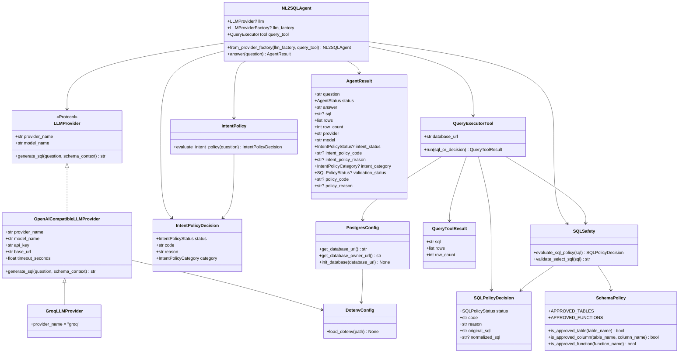
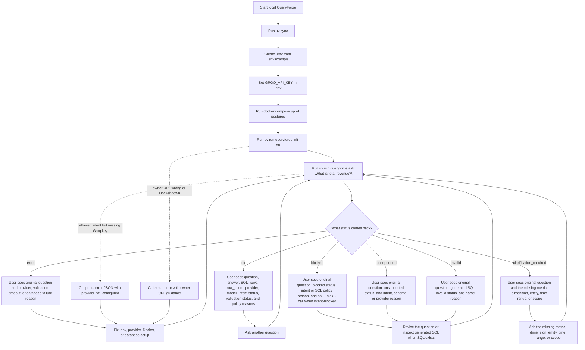

# QueryForge Architecture Diagrams

This is the living diagram page for QueryForge. Update it whenever an OpenSpec change alters the user flow, module boundaries, core classes, result models, statuses, setup steps, or execution path.

Current scope: local CLI Ask Data flow for Postgres.

## Code Flow

## Class Diagram

## User Action Diagram

## Maintenance Checklist

- Update the code-flow diagram when the execution path changes.
- Update the class diagram when core classes, protocols, result models, or policy contracts change.
- Update the user action diagram when setup commands, CLI commands, or user-visible statuses change.
- Keep module boundaries SOLID-aligned: providers generate candidates, policy validates, executors run approved work, models define contracts, and agents orchestrate.
- Add abstractions only when they protect a real extension point or remove meaningful coupling.
- Keep future-stage features out of the current diagram until they exist in code.
