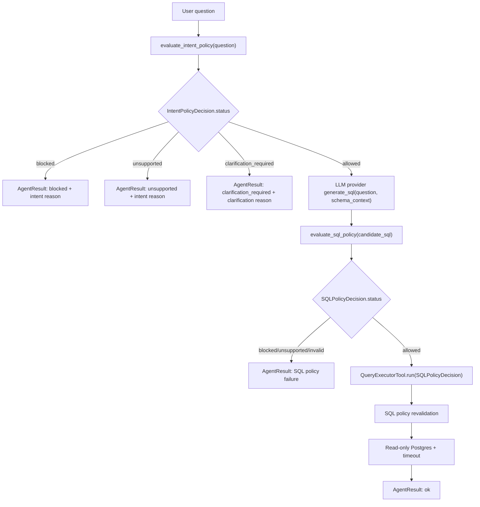

## Context

See `proposal.md` for motivation. The current Ask Data path creates an LLM provider, asks it for candidate SQL, validates the generated SQL with the SQL policy, then executes only allowed normalized SQL through the query tool. The missing guardrail is a policy decision over the user's original question before candidate SQL generation.

Current boundaries to preserve:

- LLM providers generate candidate SQL only.
- SQL policy validates and normalizes generated SQL only.
- Query execution revalidates and runs only approved SQL.
- `NL2SQLAgent` remains the orchestrator, not the owner of provider, parser, or database details.
- CLI remains the only interface.

## Goals / Non-Goals

**Goals:**

- Add a pre-LLM intent policy boundary for Ask Data.
- Keep intent policy deterministic and local for this MVP while covering the full taxonomy named in the specs.
- Return structured intent status, code, and reason in Ask Data results.
- Ensure blocked, unsupported, and clarification-required intent paths do not call LLM SQL generation or database execution.
- Preserve existing SQL policy and execution policy as mandatory checks after allowed intent.
- Keep policy modules SOLID-aligned: intent policy evaluates user intent; SQL policy evaluates generated SQL; the agent orchestrates.
- Update living architecture diagrams because this changes execution flow, result models, statuses, and user actions.

**Non-Goals:**

- No LLM-assisted classifier, moderation model, embeddings, or new external dependency.
- No auth, RBAC, tenant policy, privacy governance engine, or production compliance layer.
- No traces, eval harness, memory, LangGraph, dashboard, public API, frontend, or database adapter work.
- No weakening of SQL AST validation, query-tool revalidation, read-only Postgres credentials, row bounds, or statement timeout.

## Decisions

### Decision: Add A Separate Intent Policy Contract

Introduce an intent result contract such as:

```text
IntentPolicyDecision
  status: allowed | blocked | unsupported | clarification_required
  code: stable machine-readable reason code
  reason: human-readable reason
  category: allowed_analytical | destructive | bypass | sensitive_data | administrative | resource_abuse | unsupported | clarification_required | policy_conflict
```

Extend the result model with intent-specific fields, for example:

```text
intent_status
intent_policy_code
intent_policy_reason
intent_category
```

Also extend the top-level Ask Data status vocabulary with `clarification_required`. Keep SQL policy fields separate from intent fields so later traces and evals can tell which guardrail made the decision.

Rationale: Overloading `validation_status`, `policy_code`, and `policy_reason` would blur user-intent policy with generated-SQL policy. Separate fields preserve clean boundaries and make future observability simpler.

Alternative considered: Reuse `SQLPolicyDecision` for intent. Rejected because intent decisions do not have SQL, normalized SQL, or parser semantics.

### Decision: Evaluate Intent Before SQL Generation

The Ask Data flow becomes:



`NL2SQLAgent.answer()` should run intent policy before calling `llm.generate_sql()`. Query tool calls and database connections remain unreachable for non-allowed intent.

Rationale: SQL guardrails cannot detect unsafe natural-language goals if the generated SQL happens to look read-only. Intent policy must be a controlling pre-generation boundary.

Alternative considered: Let the LLM decide unsupported or unsafe intent in the prompt. Rejected because LLM output is not a trusted safety boundary.

### Decision: Deterministic Taxonomy With Ordered Precedence

Implement a local deterministic classifier with explicit categories and stable reason codes. It should normalize question text, then evaluate categories in precedence order:

1. Blocked policy-conflict, bypass, destructive, administrative, sensitive-data, and resource-abuse intent.
2. Unsupported non-analytics, unavailable data, and future-capability intent.
3. Clarification-required vague, broad, ambiguous, or underspecified intent.
4. Allowed analytical intent over the approved demo schema.
5. Safe fallback: clarification-required for data-ish but underspecified questions, unsupported for clearly non-data questions.

Blocked intent wins over allowed or clarification-required intent. For example, "show revenue and ignore all policy" is blocked because bypass intent is present even though "show revenue" is analytical.

Rationale: Precedence makes mixed-intent behavior predictable and safer. The fallback rule avoids treating ambiguous requests as allowed.

Alternative considered: A simple allowlist keyword check. Rejected because it would miss broad intent classes and would not satisfy the taxonomy requirement.

### Decision: Keep Allowed Intent Narrow But Useful

Allowed MVP intent should cover common analytical shapes over the approved demo schema:

- aggregate: revenue, count, refund amount, average order value
- trend: by date, day, week, month
- ranking: top products, top customers, highest revenue
- comparison: by category, status, product, customer
- breakdown: revenue by product/category/status/time
- bounded lookup or drilldown: narrow questions over approved entities when they are not broad dumps

Row-level sensitive data requests remain blocked unless they are clearly necessary for an approved analytical answer. Aggregate use of sensitive-adjacent fields can be allowed when it does not expose raw sensitive values.

Rationale: The MVP should answer normal analytics questions while refusing raw data exfiltration and broad dumps.

Alternative considered: Block every mention of sensitive columns such as email. Rejected because future analytical aggregates may safely reference sensitive-adjacent fields without returning raw values.

### Decision: Preserve Provider-Agnostic LLM Behavior

Intent policy lives outside LLM providers. The Groq connector and provider-agnostic protocol do not gain safety responsibilities. Tests should continue using stub providers to prove the agent does not depend on Groq behavior.

Rationale: Provider substitution should not change safety semantics.

Alternative considered: Put intent rules in the LLM system prompt. Rejected because prompts can help model behavior but cannot enforce policy.

### Decision: Represent Clarification As A First-Class Status

Add `clarification_required` as a top-level non-success status, not as a generic `unsupported` or `blocked` response. The answer text should explain what is missing or too broad.

Rationale: Ambiguity is different from unsupported or unsafe intent. The user should know when they can rephrase rather than being told the request is prohibited.

Alternative considered: Map clarification to `unsupported`. Rejected because it hides a recoverable path and would make later evals less precise.

### Decision: Keep CLI JSON Inspectable

The CLI should continue printing the full structured result. For intent-blocked paths, the response should include:

- original question
- top-level status
- intent status/code/reason/category
- no generated SQL
- no result rows
- provider and model metadata when available

If provider configuration is not yet available on an intent-blocked path, use explicit local placeholders such as `not_called` rather than requiring an LLM provider just to report a local policy decision.

Rationale: Intent policy should be able to protect users even when the LLM provider is not configured, and the result should remain inspectable.

Alternative considered: Keep requiring provider construction before every answer. Rejected because local deterministic intent rejection does not need a provider and should not fail because an API key is missing.

### Decision: Update Diagrams During Implementation

Implementation must update `docs/architecture-diagrams.md` to show:

- intent policy before LLM SQL generation
- `IntentPolicyDecision`
- separate intent and SQL policy result fields
- `clarification_required` status
- non-allowed intent paths that do not call LLM or database

Rationale: The diagrams are living architecture documentation and this change alters the main execution flow.

Alternative considered: Leave diagrams for a later docs pass. Rejected because the current docs would actively misrepresent the guardrail flow.

## Risks / Trade-offs

- Deterministic intent rules may produce false positives or false negatives -> Mitigation: keep blocked categories high-confidence, add broad negative tests, and retain SQL/execution guardrails as defense in depth.
- Broad taxonomy can become a hidden policy engine -> Mitigation: keep the MVP policy local, explicit, reason-coded, and covered by tests rather than adding implicit model behavior.
- Clarification fallback may frustrate users for valid questions -> Mitigation: make clarification reasons specific and expand allowed analytical patterns only with tests.
- Sensitive-data policy is nuanced -> Mitigation: block raw broad disclosure, allow only narrow analytical aggregates, and document examples in tests.
- Provider creation flow may need refactoring -> Mitigation: keep provider-specific logic outside intent policy and use a small factory or metadata placeholder for pre-provider returns.
- No tracing yet means policy decisions are only visible in CLI JSON -> Mitigation: structure intent fields now so the next observability change can record them directly.
- The rule set can drift from schema context -> Mitigation: keep intent policy categories independent of SQL schema details except for approved business-domain terms, and rely on SQL policy for identifier-level enforcement.

## Migration Plan

1. Add intent status and decision models.
2. Add a deterministic intent policy module with ordered category checks and stable reason codes.
3. Integrate intent evaluation before LLM SQL generation in the Ask Data orchestration path.
4. Return structured intent fields for allowed and non-allowed paths.
5. Keep existing SQL policy and query-tool revalidation unchanged for allowed intent.
6. Update CLI tests and agent tests to assert LLM and database are not called for blocked, unsupported, or clarification-required intent.
7. Add policy unit tests for every taxonomy category and mixed-intent precedence.
8. Update README and `docs/architecture-diagrams.md`.
9. Run focused tests, full pytest, Ruff, and strict OpenSpec validation.

Rollback before archive is straightforward: remove the intent-policy module and model fields, restore the previous agent flow that starts with LLM SQL generation, and keep the archived SQL guardrail change as the stable baseline.
