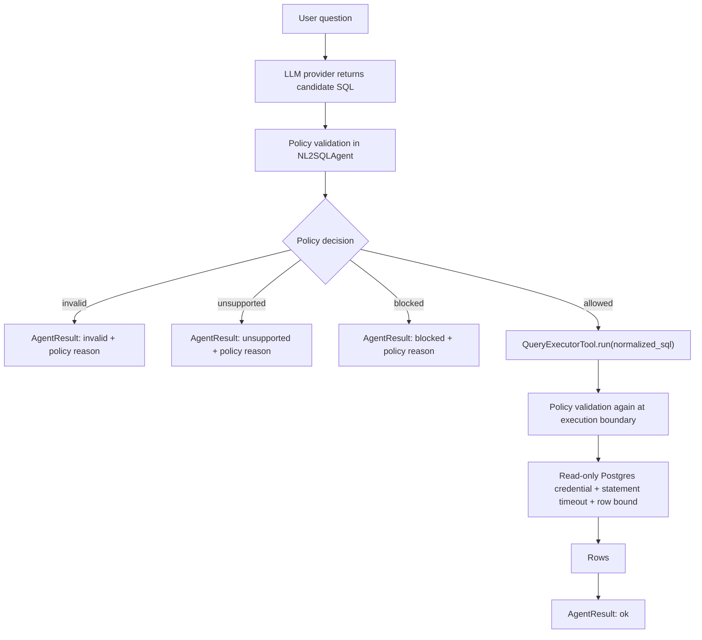

## Context

See `proposal.md` for motivation. The current v0 path validates generated SQL with `validate_select_sql(sql) -> str`, blocks comments, multiple statements, non-SELECT expressions, and a keyword denylist, then the query tool validates again before using psycopg.

That shape is useful, but v1 needs a richer decision than "returns SQL or raises." The guardrail layer must explain whether a candidate is allowed, blocked, unsupported, or invalid, and why. It also needs enough schema knowledge to block unknown identifiers before Postgres sees the query.

Current implementation boundaries to preserve:

- `NL2SQLAgent` remains the thin orchestrator.
- LLM providers remain interchangeable and do not own safety policy.
- SQL safety remains outside the LLM provider.
- The query executor still validates at the execution boundary.
- Postgres remains the only execution target.
- CLI remains the only interface.

## Goals / Non-Goals

**Goals:**

- Replace the v0 boolean-style SQL validator with an explicit policy decision object.
- Keep generated SQL untrusted until both validation and execution controls pass.
- Allow only the approved local demo schema, approved identifiers, approved clauses, and approved analytical functions.
- Return the original user question plus stable policy status and policy reason in Ask Data results.
- Keep multi-row answers useful by showing bounded row values while preserving structured rows.
- Add defense in depth with a local read-only Postgres execution role.
- Preserve SOLID-aligned module boundaries: providers generate candidate SQL, policy modules validate and classify, executors run approved SQL, models define contracts, and the agent orchestrates the flow.
- Update `docs/architecture-diagrams.md` during implementation because this change affects execution flow, result models, and user-visible statuses.

**Non-Goals:**

- No public API, frontend, dashboards, memory, eval harness, LangGraph, governance workflow, or database adapter abstraction.
- No natural-language policy classifier beyond what can be inferred from LLM output, schema context, SQL validation, and provider unsupported markers.
- No production SQL firewall. This is a local CLI guardrail layer with focused policy coverage.
- No attempt to safely support arbitrary user SQL. The supported path remains NL question to generated analytical SQL.

## Decisions

### Decision: Introduce A Policy Decision Contract

Add a small contract such as:

```text
SQLPolicyDecision
  status: allowed | blocked | unsupported | invalid
  reason: human-readable policy reason
  code: stable machine-readable reason code
  original_sql: candidate SQL
  normalized_sql: SQL to execute when allowed
```

The validator returns this object instead of exposing only `str` or `SQLSafetyError`. Existing callers can use a compatibility wrapper during the change, but the agent and query tool should move to the decision object.

Rationale: Ask Data needs to report the validation outcome and policy reason. Exceptions alone make it harder to distinguish invalid SQL, unsupported schema references, and blocked unsafe behavior.

Alternative considered: keep raising `SQLSafetyError` with better text. Rejected because the product now needs stable status and reason data in the result payload.

### Decision: Add Policy Fields To Agent Results

Extend `AgentResult` with fields such as:

```text
validation_status: allowed | blocked | unsupported | invalid | null
policy_code: string | null
policy_reason: string | null
```

Extend the top-level status vocabulary to include `invalid` if needed for malformed or unevaluable generated SQL. The existing `question` field already preserves the original user question and must remain present in every response.

Rationale: CLI users should see what they asked, what SQL was produced when available, and why the request could or could not run.

Alternative considered: encode policy details inside `answer` only. Rejected because downstream tests and later trace/eval work need structured policy fields.

### Decision: Use A Static Demo Schema Policy For V1

Create a local schema policy from the demo database contract:

```text
public.customers: id, name, email, created_at
public.products: id, name, category, unit_price
public.orders: id, customer_id, order_date, status
public.order_items: id, order_id, product_id, quantity, unit_price
public.refunds: id, order_id, refund_date, amount, reason
```

Only these tables and columns are allowed. Explicit references to `pg_catalog`, `information_schema`, temp schemas, extension schemas, or unknown schema names are unsupported or blocked. Unqualified approved table names resolve to the approved demo schema.

Rationale: dynamic metadata is a later roadmap stage. A static policy gives immediate safety value and testability without adding metadata refresh behavior.

Alternative considered: introspect the live database on every run. Rejected because that pulls metadata work forward before the guardrail layer is stable.

### Decision: Parse Behavior, Not Text Fragments

Continue using SQLGlot for parsing, but walk the parsed AST to enforce policy:

- one statement only
- approved SELECT-shaped analytical reads only
- no data-modifying CTEs
- no `SELECT INTO`
- no row-locking clauses such as `FOR UPDATE`
- no comments or stacked statements
- no star projection
- no unknown tables, schemas, or columns
- no system metadata reads
- no unapproved functions
- no joins that cannot be checked against approved identifiers

Keep a small text-level precheck for comments and statement stacking before parse, then rely on AST inspection for behavior.

Rationale: text denylisting misses aliases, casing, nested queries, set operations, and other parser bypass attempts.

Alternative considered: use only regex and keyword checks. Rejected because the proposal explicitly targets SQL edge cases that require parsed structure.

### Decision: Use Function Allowlist, Not Function Denylist

Allow a small analytical function set, for example:

```text
COUNT, SUM, AVG, MIN, MAX, ROUND, COALESCE, DATE_TRUNC
```

Block or reject everything else until explicitly needed. This includes functions that can read files, delay execution, notify listeners, mutate sequences, take advisory locks, execute dynamic SQL, inspect settings, or perform administrative work.

Rationale: PostgreSQL has many functions that are syntactically usable inside SELECT but are not appropriate for an NL2SQL analytics tool.

Alternative considered: maintain a denylist of dangerous functions. Rejected because denylist gaps are likely and harder to reason about.

### Decision: Apply Row Bounds At The Policy Boundary

For row-returning queries, either:

1. normalize the SQL by adding a default `LIMIT`, or
2. block with a clear policy reason when a safe bound cannot be applied.

Aggregate queries that return a bounded number of rows by construction can pass without a synthetic limit. The implementation should keep the rule simple for v1 and cover edge cases with tests.

Rationale: unbounded result sets are both a usability problem and an exfiltration/resource risk.

Alternative considered: execute first and truncate rows in Python. Rejected because the database would still perform and return unbounded work.

### Decision: Keep Double Validation

The agent validates before calling the query tool, and the query tool validates again immediately before Postgres execution.



Rationale: future code may call the query tool directly. The executor must remain a safety boundary.

Alternative considered: validate only in the agent. Rejected because it makes safety depend on one caller path.

### Decision: Keep Guardrail Modules Small And Boundary-Oriented

Structure the implementation around narrow responsibilities:

- LLM providers generate candidate SQL only.
- Schema policy defines the approved demo data context.
- SQL policy parses, validates, classifies, and normalizes candidate SQL.
- Query execution runs only allowed normalized SQL and rechecks policy first.
- Result models carry structured statuses, policy codes, reasons, SQL, and rows.
- The agent coordinates these pieces without owning provider, parser, or database details.

Rationale: the next roadmap stages need traces, evals, memory, adapters, governance, and dashboards. Clear boundaries now make those additions possible without rewriting the core agent loop.

Alternative considered: keep all guardrail logic inside the existing validator function or agent method. Rejected because that would increase coupling and make future policy, tracing, and adapter work harder to isolate.

### Decision: Add A Read-Only Local Execution Role

Keep the platform/init credential for schema creation and seeding. Add a separate read-only execution credential for Ask Data query execution. Grant it SELECT on approved demo tables only, and set default environment examples so query execution uses the read-only URL.

Rationale: least privilege catches missed validation defects and makes local development closer to the intended trust model.

Alternative considered: keep using the owner credential for simplicity. Rejected because this change is specifically about reducing unsafe execution risk.

### Decision: Keep Unsupported Handling Provider-Agnostic

The provider can still return the exact unsupported marker, but QueryForge policy also classifies unknown schema references or out-of-scope SQL as unsupported after generation. The LLM provider does not decide execution safety.

Rationale: the provider can help identify unsupported questions, but policy must remain outside the model.

Alternative considered: add a separate LLM classifier. Rejected for v1 because it adds model calls and does not strengthen the deterministic execution boundary.

### Decision: Update Living Diagrams During Implementation

This change affects the code flow, class diagram, result model, and user action statuses. Implementation must update `docs/architecture-diagrams.md` to show:

- the policy decision object
- validation status and policy reason on results
- double validation at agent and executor boundaries
- read-only Postgres execution role
- `invalid` or equivalent policy-invalid status behavior

Rationale: the project now treats the diagrams as living architecture documentation.

Alternative considered: update diagrams after archive. Rejected because diagram drift is easiest to prevent while changing code.

## Risks / Trade-offs

- Hallucinated identifiers still appear plausible -> Mitigation: static schema allowlist and tests for unknown tables, columns, aliases, and schema-qualified references.
- SQLGlot may parse PostgreSQL constructs differently than Postgres executes them -> Mitigation: add safety-negative tests for each targeted construct and keep read-only database privileges as defense in depth.
- False positives may block legitimate analytical questions -> Mitigation: keep v1 function and clause allowlists small, then expand with tests when real questions need more.
- Automatically adding `LIMIT` can change user intent -> Mitigation: apply limits only to row-returning queries and report normalized SQL in the CLI result.
- Read-only role setup may complicate local initialization -> Mitigation: keep owner/init URL and execution URL explicit in `.env.example` and README.
- Policy result fields increase model churn -> Mitigation: update tests and diagrams in the same change so the new contract is explicit.
- Observability remains limited -> Mitigation: keep policy code/reason structured now so the later traces stage has useful data to record.

## Migration Plan

1. Add policy decision models and reason-code vocabulary.
2. Replace direct `validate_select_sql` usage in the agent with the policy decision path.
3. Preserve or adapt a compatibility validation helper for tests and the execution boundary.
4. Implement schema, identifier, clause, function, row-bound, and Postgres edge-case checks.
5. Update query execution to use normalized allowed SQL only and to re-run policy validation before connecting.
6. Add read-only demo database role and execution URL configuration.
7. Update CLI result models, answer rendering, README setup notes, and `docs/architecture-diagrams.md`.
8. Add focused unit and integration tests for policy decisions, executor bypass protection, read-only role behavior, and user-visible result fields.
9. Run `uv run pytest`, `uv run ruff check .`, `openspec validate harden-nl2sql-guardrails-v1 --strict`, and `openspec validate --all --strict`.

Rollback before archive is straightforward: revert this change's code and docs, restore the v0 validator behavior, and keep the archived v0 OpenSpec artifacts as the last stable baseline.
