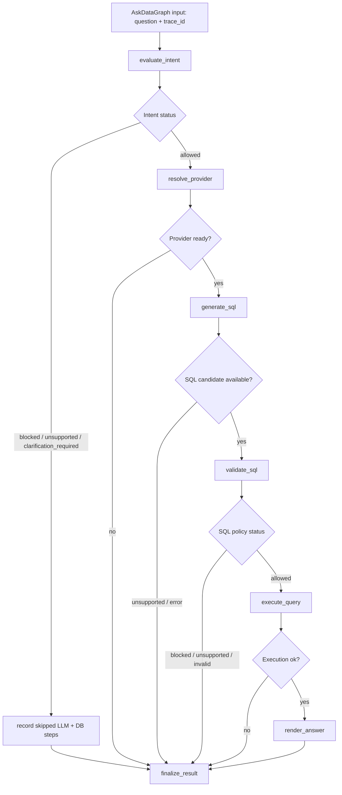

## Context

See `proposal.md` for the motivation and product scope. The current code is a local CLI Ask Data flow:

```text
question -> intent policy -> LLM provider -> generated SQL -> SQL policy -> query executor -> Postgres -> AgentResult JSON
```

The existing boundaries are intentionally small: `NL2SQLAgent` orchestrates the flow, `LLMProvider` generates candidate SQL, deterministic intent policy evaluates the original question, SQL safety validates generated SQL, and `QueryExecutorTool` revalidates before executing against read-only Postgres credentials.

This change adds a graph and observability foundation without changing QueryForge's trust model. User input, LLM output, trace history, callbacks, and future memory remain untrusted. QueryForge-owned policy checks continue to decide whether SQL can be generated or executed.

The change must also keep the CLI usable when Langfuse is not configured. Normal tests must not require a Langfuse server, hosted Langfuse account, Groq key, or network calls.

## Goals / Non-Goals

**Goals:**

- Replace the hidden linear orchestration inside `NL2SQLAgent.answer()` with explicit LangGraph stages for the current Ask Data workflow.
- Preserve the current CLI command and current safety order.
- Add a `trace_id` to every `AgentResult`, including blocked, unsupported, clarification-required, invalid, and error paths.
- Record a bounded local trace timeline for each run with step names, statuses, durations, key policy decisions, provider/model metadata, generated or normalized SQL when available, row counts, preview rows, and failure reasons.
- Export traces to Langfuse only when configured.
- Keep LLM providers provider-agnostic and keep Langfuse behind an outbound observability interface.
- Update tests, README, and `docs/architecture-diagrams.md` to reflect the new graph and trace flow.

**Non-Goals:**

- No website, public API, dashboard generation, eval harness, memory, governance, or multi-database adapter work in this change.
- No Inngest workflow runtime. Durable/background orchestration is deferred until there are scheduled, async, or long-running jobs.
- No LangSmith integration.
- No persistent local trace store. The MVP trace is returned in the result and optionally exported.
- No LLM-assisted intent classifier. Intent policy remains deterministic for this stage.
- No trace-history-based approval. Observability records facts; it cannot approve generation or execution.

## Decisions

### 1. Use LangGraph for orchestration, keep `NL2SQLAgent` as the facade

`NL2SQLAgent.answer(question)` remains the public entry point used by the CLI. Internally it will invoke a compiled LangGraph workflow instead of directly running all steps inline.

Planned graph stages:



Rationale: LangGraph makes each stage and branch explicit now, which gives later evals, memory, repair loops, dashboards, and governance stable attachment points. It is still small enough for the current CLI because nodes can call existing QueryForge functions directly.

Alternative considered: keep the current linear method and add manual trace calls around each block. That is smaller in the short term, but it hides the workflow shape that later agent stages need and would likely be rewritten when repair loops and dashboards arrive.

### 2. Use typed graph state plus Pydantic public contracts

Add an internal `AskDataGraphState` using a `TypedDict` or equivalent state schema for LangGraph. It carries the mutable run state: question, trace id, intent decision, provider/model, generated SQL, SQL decision, rows, row count, answer, status, error metadata, and trace steps.

Keep `AgentResult`, `SQLPolicyDecision`, `IntentPolicyDecision`, and `QueryToolResult` as Pydantic models at module boundaries. Add trace fields to `AgentResult` rather than exposing LangGraph internals.

Rationale: LangGraph nodes naturally pass partial state updates. Pydantic remains better for user-visible JSON contracts and tests.

Alternative considered: make the LangGraph state itself a Pydantic model. That provides stricter validation but adds friction because each node would repeatedly copy/merge the full model. The public contract already provides validation where it matters for callers.

### 3. Add a QueryForge observability boundary before Langfuse-specific code

Introduce a small observability module with QueryForge-owned contracts:

```text
TraceRecorder protocol
RunTrace
TraceStep
TraceStepStatus
NoOpTraceRecorder / LocalTraceRecorder
LangfuseTraceExporter
TraceRedactor
```

The graph records each step through the recorder. The Langfuse adapter translates the finished QueryForge trace into Langfuse observations only when enabled.

Rationale: QueryForge should not depend on Langfuse concepts in core policy, execution, or result models. Keeping an interface lets local tests use a fake recorder and lets future providers or self-hosted deployments change observability without changing guardrails.

Alternative considered: call Langfuse directly from every graph node. That would be quick, but it would couple safety-critical modules to a third-party backend and make disabled/offline behavior harder to test.

### 4. Make Langfuse optional and fail-open only for observability

Configuration will be read from `.env` or shell variables, matching the existing provider setup style:

```text
QUERYFORGE_OBSERVABILITY_PROVIDER=langfuse
LANGFUSE_PUBLIC_KEY=...
LANGFUSE_SECRET_KEY=...
LANGFUSE_BASE_URL=...
QUERYFORGE_TRACE_PREVIEW_ROWS=5
```

If the observability provider is unset or required Langfuse credentials are missing, QueryForge uses local/no-op tracing and still returns `trace_id`. If Langfuse export fails, the trace records an observability export error, but an otherwise successful query remains successful.

Rationale: observability should improve debuggability, not become a runtime prerequisite for the local CLI.

Alternative considered: require Langfuse configuration before graph execution. That conflicts with local MVP ergonomics and would make normal tests dependent on an external service.

### 5. Treat traces as bounded diagnostic data

Trace payloads will include enough data to debug the run, but not full secrets or unbounded results. The redaction layer will remove or replace secret-like keys and values before data is attached to a trace or export payload.

Trace data policy:

- Include the original question because the CLI result already exposes it and debugging requires it.
- Include provider and model names, but never provider API keys.
- Include generated SQL and normalized SQL when available because SQL guardrail debugging requires them.
- Include row count and a bounded preview, not full result sets.
- Exclude raw environment variables, authorization headers, database passwords, and provider request headers.

Rationale: traces are useful only if they explain policy and execution decisions, but traces are also a data leakage surface.

Alternative considered: store only statuses and omit SQL/row previews. That would be safer but too weak for debugging generated-SQL failures and later evals.

### 6. Preserve provider-agnostic LLM access

The existing `LLMProvider` protocol remains the LLM boundary for this change. Graph nodes call `llm.generate_sql(question, schema_context)` through that protocol. LangChain/LangGraph are orchestration infrastructure, not the public provider API.

Provider-specific details stay in connectors such as `GroqLLMProvider`. Future OpenAI, Gemini, NVIDIA, and Claude connectors should implement the same provider boundary or a deliberately revised provider interface.

Rationale: the product direction is plug-and-play providers. This change should not lock QueryForge into one provider library while solving observability.

Alternative considered: replace all providers with LangChain chat model classes immediately. That may help later tool-calling, but it is a larger migration than this observability feature needs and would risk breaking the working Groq connector.

### 7. Keep safety order unchanged

The graph route must enforce this order:

```text
intent policy -> provider resolution -> SQL generation -> SQL policy -> executor revalidation -> database execution
```

If intent policy returns `blocked`, `unsupported`, or `clarification_required`, the LLM and database nodes are not called. If SQL policy returns `blocked`, `unsupported`, or `invalid`, the database node is not called. The executor continues to revalidate before opening the database connection.

Rationale: observability and graph orchestration are not safety authorities. Explicit branches make skipped unsafe work inspectable.

Alternative considered: generate SQL first and let SQL validation catch unsafe outcomes. That loses the pre-LLM protection added in the previous guardrail change and sends policy-violating requests to the provider.

### 8. Expose bounded trace metadata through CLI JSON

For this change, `queryforge ask` still prints one JSON response. `AgentResult` gains `trace_id` and a bounded `trace` object containing the ordered local step timeline. No separate `queryforge traces` command is required yet.

Rationale: the current interface is intentionally one CLI command, and there is no persisted trace lookup yet. Returning bounded trace metadata in the response makes the CLI inspectable without inventing a second interface.

Alternative considered: add `queryforge trace <trace_id>`. Without a persisted trace store, this would be a fake interface or require extra storage outside the feature scope.

### 9. Use explicit QueryForge trace events as the source of truth

Langfuse supports LangChain callback-based tracing, including LangGraph execution, but QueryForge will not rely on callbacks as the only source of observability for this change. Each graph node records explicit QueryForge trace events. The Langfuse exporter may use the Langfuse SDK or callback integration internally, but exported data must be derived from the QueryForge `RunTrace`.

Rationale: deterministic policy nodes, skipped branches, redaction, and bounded previews are product-specific. Recording them explicitly keeps observability complete even when provider calls are not yet LangChain chat model calls.

Alternative considered: pass a Langfuse callback handler to graph invocation and rely on automatic capture. That is useful for framework-level spans, but it is not enough to prove QueryForge-specific safety decisions and skipped execution paths.

## Risks / Trade-offs

- Graph framework adds complexity -> Keep graph nodes thin wrappers over existing policy, provider, validation, execution, and rendering functions.
- Langfuse SDK or callback behavior changes -> Hide SDK usage behind `LangfuseTraceExporter` and test against QueryForge export payloads, not Langfuse internals.
- Trace payload leaks secrets or too much data -> Centralize redaction and bounded previews, then add negative tests for API keys, database URLs, auth headers, and large result sets.
- Observability failure masks product success -> Catch export errors and record them separately without changing successful query status.
- Trace IDs become confused with approval IDs -> Name and document them as diagnostic identities only; executors continue to accept only validated policy decisions.
- Graph state diverges from `AgentResult` -> Centralize final result assembly in one node and test every terminal status.
- Added dependencies slow local setup -> Add only the packages needed for LangGraph/LangChain integration and Langfuse export, then pin them in `uv.lock`.
- Current provider is not a LangChain chat model -> Keep provider calls behind the existing protocol and trace them manually through QueryForge recorder until provider adapters are deliberately migrated.

## Migration Plan

1. Add LangGraph, LangChain core integration dependency if needed by LangGraph, and Langfuse to `pyproject.toml`; update `uv.lock`.
2. Add trace models, redaction, recorder interfaces, local/no-op recorder, and Langfuse exporter under `src/queryforge/observability.py` or a small `observability/` package.
3. Add trace identity fields to `AgentResult` and related tests.
4. Build `AskDataGraph` as a graph module that calls existing intent, provider, SQL safety, query execution, and answer-rendering code.
5. Refactor `NL2SQLAgent.answer()` to invoke the graph while preserving the current public method, statuses, result fields, and CLI output shape.
6. Add optional Langfuse configuration to `.env.example` and runtime config loading.
7. Add tests for successful, intent-blocked, unsupported, clarification-required, invalid SQL, provider-error, database-error, disabled Langfuse, enabled exporter with fake client, export failure, redaction, bounded previews, and distinct trace IDs.
8. Update README and `docs/architecture-diagrams.md`.
9. Run `uv run pytest`, `uv run ruff check .`, `openspec validate introduce-langgraph-langfuse-observability-v1 --strict`, and `openspec validate --all --strict`.

Rollback is straightforward before archive: revert the graph and observability modules plus dependency additions, then return `NL2SQLAgent.answer()` to its previous inline flow. No database migration or persistent data rollback is needed because this change does not add storage.
