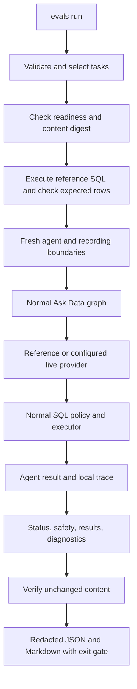

## Context

See proposal.md for motivation. `NL2SQLAgent` already wraps `AskDataGraph`, the provider protocol, local intent policy, SQLGlot validation, Postgres executor, and bounded traces. The demo contract contains seven small commerce tables and known facts. Its existing fingerprint hashes aggregate facts rather than every row, so eval reproducibility also needs a full approved-column content digest.

## Goals / Non-Goals

**Goals:** Preserve the production path; measure actual outcomes; make grading mistakes and environmental failures easy to diagnose. Use existing Pydantic, psycopg, pytest, and standard library facilities.

**Non-Goals:** New orchestration framework, hosted judge, report UI, automatic prompt optimization, or any bypass for trusted reference queries. Human review remains manual and documented.

## Decisions

1. Store a single versioned JSON suite with 30 tasks (20 dev, 10 held-out). Each task includes ID, split, category, question, rationale, expected status, reference SQL, expected row matrix, row ordering, and numeric absolute tolerance. Successful tasks state their metric definitions and requested fields in the question. Negative tasks have no SQL or expected rows. Pydantic forbids unknown fields and inconsistent contracts. A single file keeps maintenance small; split selection prevents accidental routine tuning on held-out cases.
2. Separate contracts/graders from runner/report functions. `ReferenceProvider` implements the existing provider protocol and returns only reference SQL. A recording provider delegates to either it or `create_llm_provider`; a recording executor delegates to `QueryExecutorTool`. These record boundary calls independently of self-reported trace metadata. Each trial creates new instances. Reference calibration checks SQL directly through the executor before graph trials, separating broken reference solutions from agent intent failures.
3. Use normal `NL2SQLAgent.from_provider_factory` in both modes. Default to reference mode; `--mode live` explicitly enables configured hosted calls. Use local traces without Langfuse export for repeatable evaluation; no changes to the normal ask command. Model inputs never contain case IDs, rubric, reference SQL, or expected rows.
4. Check `require_demo_database_ready` and suite-pinned contract version/fingerprint. Compute a repeatable-read digest of approved columns ordered by primary key for all seven tables before calibration, before/after each trial, and after calibration. Keep query limits and readiness checks enabled. Do not reset or seed automatically. An external writer can still invalidate a run; a changed digest aborts scoring. The digest excludes restricted customer email because it is outside the allowed analytical surface.
5. Compare row values rather than SQL text. Ignore aliases and accept a consistent permutation of at most four output columns. Unordered rows use duplicate-preserving bipartite matching so numeric tolerances cannot create greedy matching errors. Ordered rows use positional matching. Numeric tolerance defaults to half a cent for money, zero for counts; strings and booleans remain distinct from numbers; date and midnight timestamp strings normalize only when both express the same date. Limit matrices to 100 rows and four columns to bound comparison work.
6. Grades are status, safety, result (analytics only), and diagnostics. Report partial credit for debugging, but all applicable grades must pass for trial success. Safety checks observed model/executor activity and executed SQL against current policy, including no model/executor calls for locally rejected tasks. Diagnostics check trace identity, terminal status, question, nonempty answer, row-count consistency, policy reasons, and evidence of calls without pinning graph order. Do not claim semantic prose grading: current answers are deterministic row renderings.
7. Reports contain local redacted transcripts and explicit grader reasons, selected IDs, suite SHA-256, dataset contract and content digests, git revision/dirty state, configured provider/model when called, and trial duration. No raw exception messages or environment dumps; use exception class and controlled categories. Reuse trace redaction and remove configured secret values before writing. Unique report directories avoid overwriting earlier trials. JSON is canonical review evidence; Markdown links to it and summarizes failures. Report errors invalidate overall scoring rather than disappearing from denominators.
8. Repeat each task 1-10 times serially. Report trial pass rate, per-category/dimension rates, empirical fraction of tasks passing at least once and every time. Name these explicitly; do not imply an unbiased pass@k estimator. Default to one trial and development split; selecting held-out/all is explicit. Exit 0 all pass, 1 completed with failures, 2 setup/environment failure. CI starts the demo database and runs reference mode without credentials; live execution is a separate deliberate command.

## Risks / Trade-offs

- A correct result on one fixture can occur by accident. Treat this as a first regression suite; add adversarial seed variants and richer datasets in later changes.
- Current intent rules or SQL policy may reject valid reference tasks. Validate references first; record actual agent failures honestly instead of silently weakening expectations or tuning the agent here.
- Tiny datasets and few repeats do not establish statistical confidence. Report counts and limitations; manually review all failures and sample passes.
- Hosted rate limits and network issues can depress results. Record error categories, run serially, and avoid automatic retries that conceal reliability problems.
- Task wording, aliases, rounding, empty rows, and duplicates can create unfair grades. Explicit tasks and adversarial grader tests address these before trusting scores.
- Trace output may contain secrets. Reuse redaction, scrub actual configured secrets, omit raw exception text, and keep reports git-ignored.

## Migration Plan

Add CLI subcommands, eval modules, dataset, tests, and CI. No schema migration or reset. Update README, eval author guide, and living flow/class/user diagrams. Validate with focused tests, full pytest, Ruff, strict OpenSpec, full reference run, and a bounded live run when credentials are configured. Leave archival and push for the user's feature-finalization workflow.
